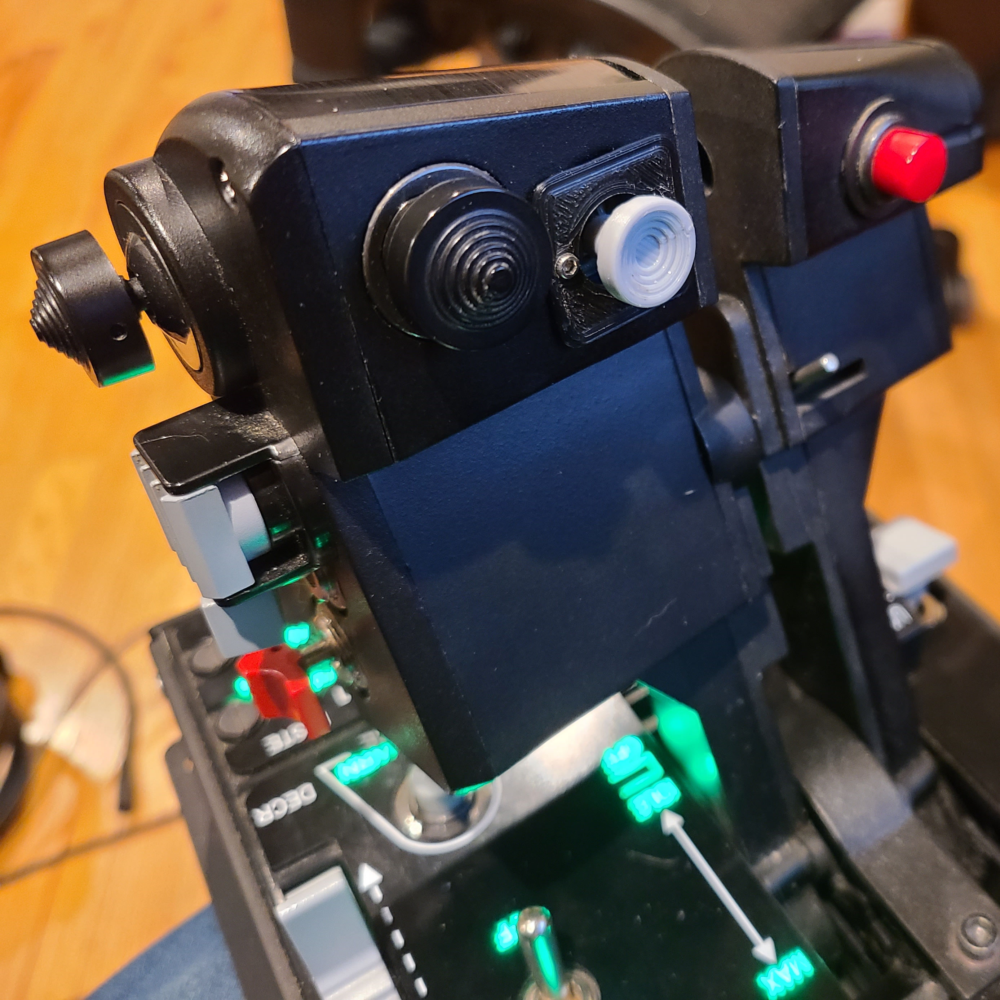

# Thrustmaster Warthog Throttle Alps Slew Mod

This repository houses the Thrustmaster Warthog Throttle Alps Slew Mod, an open source alternative to Thrustmaster's cheap slew joystick originally provided on the throttle.

## Is this Delta Sim's mod?

Nope, this was my 2022 mechcanical, electrical, and software engineering practice project. Though the [Instructable](https://www.instructables.com/Thrustmaster-Warthog-Slew-Sensor-I2C-Upgrade/) provided a good sanity check, I started from scratch and did my own logic analysis, etc.

### Why does it look similar?

It's a bare minimum set of components fitting into a tight, keyed space while being compatible with an existing product, the only way it was going to look different was if I went out of my way to do something weird.

## How can I build it?

Let me start by stating the following: This project is mostly educational. Given the amount of parts and work it takes to build one of these, you should heavily consider buying [Delta Sim's slew mod](https://deltasimelectronics.com/products/thumbstick-slew-sensor-adapter) if you're just looking to mod your throttle and fly. Since (last I checked) it uses the same microcontroller as this project, you could even potentially switch to the firmware in this repository if you believed it to be beneficial.

### I'm still here

Alright then, You'll need to handle

- [The PCB](pcb/)
- [The Plastics](plastic/)
- [The Firmware](firmware/)

## Building

- Once the PCB is complete, program it with the firmware.

- Take 4 1.6x4mm screws and connect the frame to the PCB and take care to orient the notch correctly (see photo in plastics section).

- Connect the wire to the header.

- Unplug and pop out the original slew stick by pressing in the two clasps while pulling it outward.

- Insert the new unit into the throttle. Use notch on bottom of frame to align with notch in opening.

- Use 2 remaining screws to screw cover to frame. Do not overtighten! Screw in a good amount then install the stick.

- Check stick clearance with 2 screws and continue screwing until just barely clearing the stick.

- Connect the wire to the mainboard.

- Reassemble throttle while taking extreme care not to pinch cables between the plastic posts an throttle body. Feel free to wrap longer wires around the posts before assembling Use flashlight to triple verify clearance on other side before reinstall large screws.

- Plug in throttle and download [calibration tool with modified deadzone values](https://drive.google.com/file/d/1Ltr-QlWskVfA8-Oxs-A-aUs4HPpge5iv/view?usp=sharing). Run executable and follow instructions.

- Open Control Panel and verify stick behavior under Game Controllers.