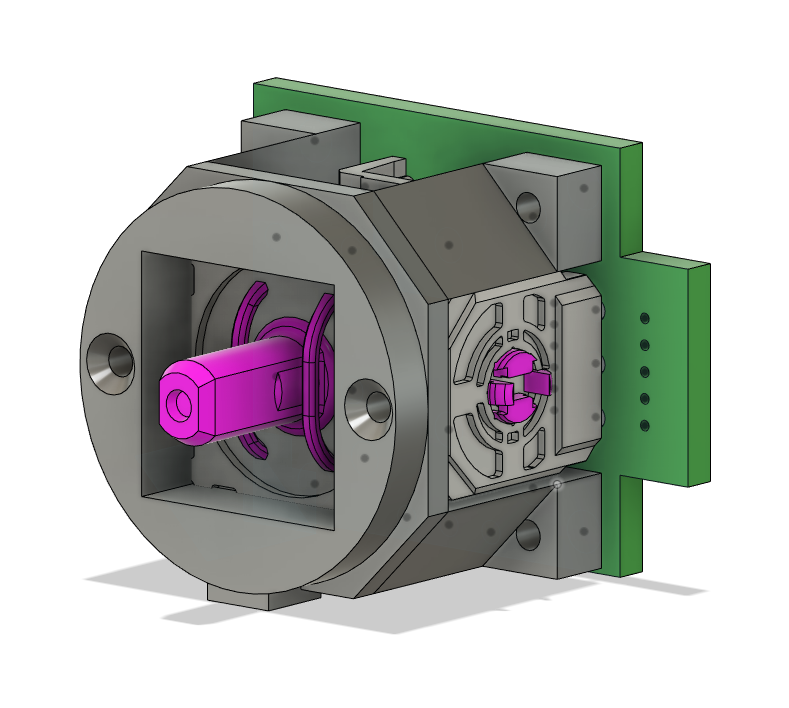

# Plastics

All plastics were designed in Fusion 360, and appropriate archive files have been uploaded.

## Printing

To print, download all 4 STL files and feed them into your slicer of choice. You can use an online printing service, but be aware of the warning below.

### Warning!

These parts were originally designed with ABS shrinkage in mind, and before uploading were rescaled (to 95.3%) for PETG based on some test runs. You may need to tweak the scaling to get a good fit across all your parts.